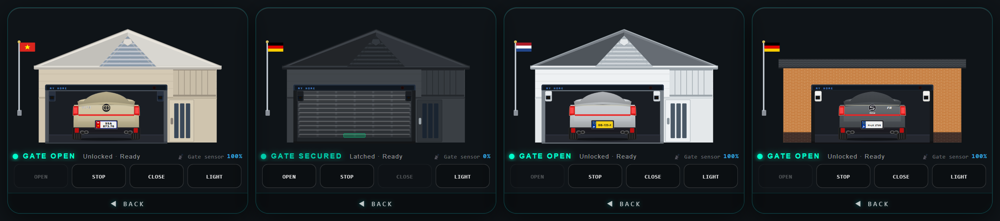
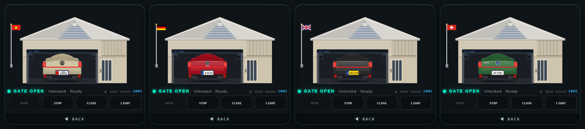
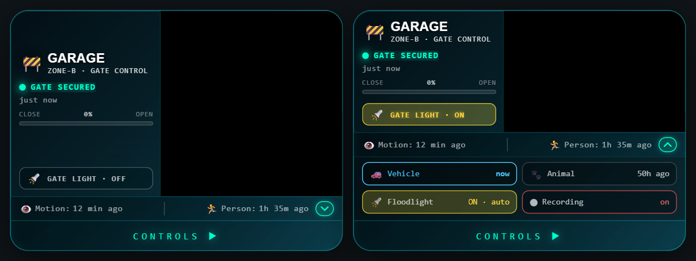

# 🚧 Gate Card

[](https://github.com/hacs/integration)


> 🇻🇳 **Phiên bản tiếng Việt:** [README_vi.md](README_vi.md)

A custom Home Assistant Lovelace card for smart gate and garage door control — live camera feed, three animated diagram styles (sliding gate, rolling shutter garage & 2-wing swing gate), motion/person sensors, gate light toggle, lock support, no-sensor timer mode, and a full visual editor.

**No extra plugins required. Works standalone, fully configurable through the built-in UI editor.**

---

## 📸 Preview


---

## 🎛️ Visual Config Editor


---

## ✨ Features (v1.3.0)

### 🎨 Display & Interface
- 🚧 **Front face** — gate title, zone label, live status with colour-coded indicator, open/close progress bar, gate light toggle button
- 📷 **Live camera snapshot** — refreshes every 5 seconds via HA camera proxy, displays in true **16:9 ratio**
- 👁️ **Motion & person sensor bar** — shows last detected time for both sensors with colour highlight when active
- 🔄 **Flip animation** — smooth fade/scale transition between front (status) and back (control) face

### 🏠 Three Diagram Styles (back face)
- **🚧 Sliding Gate** — animated SVG gate slides horizontally, lock icon when closed, PIR sensor pulse, directional motor arrows
- **🏠 Rolling Shutter / Garage** — animated rolling shutter house scene: slats roll up/down with real gate position, Vietnamese flag, car with customisable license plate, wall lamps glow when gate light is on
- **🚪 2-Wing Swing Gate** — both wings open inward symmetrically based on position (0–100%), granite stone pillars with round bulb lamps, center lock fades out as gate opens, PIR motion indicator, directional arc arrows

### 🔐 Gate Lock Support
- Enable **"Use gate lock"** and assign a lock entity
- When the lock is ON, the Open button is automatically **disabled** to prevent accidental operation
- Lock state is visible in the SVG diagram (center lock icon)

### ⚡ Pulse Switch Mode
- Enable **"Pulse switch"** if your relay only pulses briefly (~1–3 s) but the motor runs the full travel distance
- The position timer completes the full travel animation regardless of relay state

### 🔄 Sensor Invert Mode
- Enable **"Invert position sensor"** if your sensor reports reversed values (100% = closed)
- The card automatically inverts the position value before displaying

### 🚗 No Position Sensor Mode
- Toggle **"No position sensor"** in the editor to enable timer-based position estimation
- Set your gate's **travel time in seconds** — the card smoothly animates position 0→100% as the relay runs

### 🎛️ Control Panel (back face)
- **3 control buttons** — Open / Stop / Close with colour-coded active states, auto-disabled when already at limit
- **⚠️ Safety warning ticker** — scrolling alert banner while gate is opening or closing
- Button icons auto-switch per style: `↑↓` for shutter, `←→` for sliding gate, `🚪` for swing gate

### 🌐 Multi-language Support (10 languages)
- 🇻🇳 Tiếng Việt / 🇬🇧 English / 🇩🇪 Deutsch / 🇫🇷 Français / 🇳🇱 Nederlands
- 🇵🇱 Polski / 🇸🇪 Svenska / 🇭🇺 Magyar / 🇨🇿 Čeština / 🇮🇹 Italiano
- **Real country flag images** in language selector (via flagcdn.com)

### 🎨 Visual Customisation
- **16 background gradient presets** — Default, Night, Sunset, Forest, Aurora, Desert, Ocean, Cherry, Volcano, Galaxy, Ice, Olive, Slate, Rose, Teal, Custom
- **5 colour pickers** — Accent, Text, Open button, Stop button, Close button

---

## 🌍 Country, car & house style (rolling shutter)

All options are optional — without them the card looks exactly as before.



- **`house_theme`** — `beige` (default), `dark` (anthracite, fits dark mode), `white`, `brick` (flat roof with tiled fascia, brick wall with dark plinth, black sectional door with cassettes, white lanterns).
- **`side_door`** — pedestrian door `right` (default), `left` or `none` (garage door centred).



- **`country`** — flag on the pole and licence plate band: `vn` (default), `de`, `at`, `ch`, `nl`, `fr`, `it`, `pl`, `se`, `hu`, `cz`, `gb`. EU countries get the blue EU band with stars and the country code, Dutch and British rear plates are yellow. If `plate_line2` is empty the plate is shown on one line.
- **`car_brand`** — rear logo: `toyota` (default), `seat`, `vw`, `none`.
- **`car_model`** — rear badge text (default `VIOS`, `''` hides it). Long names shrink automatically; SEAT shows it centred below the logo.
- **`car_trim`** — trim badge on the right of the boot lid, e.g. `FR`.
- **`car_color`** — body colour (hex); highlights and shadows are derived automatically.

## 📷 Camera extras drawer



If any of these entities is set, the motion/person bar gets a small accent button. Tapping the bar opens a compact drawer:

- **Vehicle / Animal** detection — highlighted while active, otherwise "x min ago".
- **Floodlight** — tap to toggle, shows the mode from `entity_floodlight_mode`.
- **Recording** — tap to toggle.

On narrow cards (phones) the control buttons now show the icon above the label so all four fit.

## 📦 Installation

### Option 1 — HACS (recommended)

**Step 1:** Add Custom Repository to HACS:

[](https://my.home-assistant.io/redirect/hacs_repository/?owner=doanlong1412&repository=gate-card&category=plugin)

> If the button doesn't work, add manually:
> **HACS → Frontend → ⋮ → Custom repositories**
> → URL: `https://github.com/doanlong1412/gate-card` → Type: **Dashboard** → Add

**Step 2:** Search for **Gate Card** → **Install**

**Step 3:** Hard-reload your browser (`Ctrl+Shift+R`)

---

### Option 2 — Manual

1. Download [`gate-card.js`](https://github.com/doanlong1412/gate-card/releases/latest)
2. Copy to `/config/www/gate-card.js`
3. Go to **Settings → Dashboards → Resources** → **Add resource**:
   ```
   URL:  /local/gate-card.js
   Type: JavaScript module
   ```
4. Hard-reload your browser (`Ctrl+Shift+R`)

---

## ⚙️ Card Configuration

### Step 1 — Add the card to your dashboard

```yaml
type: custom:gate-card
```

After adding the card, click **✏️ Edit** to open the Config Editor.

### Step 2 — Config Editor sections

| # | Section | Contents |
|---|---------|----------|
| 1 | 🌐 **Language** | 10 languages with real flag images |
| 2 | 🏠 **Gate Style** | Sliding gate / Rolling shutter / 2-Wing swing gate |
| 3 | 🚧 **Gate Name** | Title, zone, license plate (line 1 & 2), home name |
| 4 | ⚡ **Entities** | All entity pickers + no-sensor mode + travel time + lock + pulse switch |
| 5 | 🎨 **Colors** | Accent, text, and 3 button colours |
| 6 | 🎨 **Background** | 16 gradient presets + custom two-colour picker |

---

## 🔄 Setting Up the Flip Button

The card has two faces — a **status face** (front) and a **control face** (back). Tapping the **CONTROLS ▶** bar at the bottom flips to the controls; **◀ BACK** flips back. To make this work properly across page reloads and multiple devices, you need to create a simple **Toggle helper** in Home Assistant first.

### Step 1 — Create a Toggle helper

Go to **Settings → Devices & Services → Helpers** → **+ Create helper** → **Toggle**

| Field | Value |
|-------|-------|
| **Name** | `gate card flipped` (HA auto-generates `input_boolean.gate_card_flipped`) |
| **Icon** | *(optional)* `mdi:rotate-3d-variant` |

Click **Create**.

> 💡 **Multiple cards?** Create one helper per card and give each a unique name — for example `input_boolean.garage_card_flipped` and `input_boolean.side_gate_flipped`. If two cards share the same helper, flipping one will flip the other too.

### Step 2 — Assign it in the Config Editor

Open the card editor → expand **Entities** → find **🔄 Flip state boolean** → select `input_boolean.gate_card_flipped`.

Or set it in YAML directly:

```yaml
entity_flipped: input_boolean.gate_card_flipped
```

### Step 3 — Done ✅

The flip state is now stored in Home Assistant. It persists across page reloads and stays in sync on all devices.

> ⚠️ Without this helper the flip button still works locally within your current browser session, but the state resets on reload and won't sync across devices.

---

## 🔌 Entity Reference

### Required

| Config key | Entity type | Description |
|---|---|---|
| `entity_gate_open` | `switch` | Open relay ✅ |
| `entity_gate_close` | `switch` | Close relay ✅ |
| `entity_gate_stop` | `switch` | Stop relay ✅ |

### Optional

| Config key | Entity type | Description |
|---|---|---|
| `entity_gate_position` | `sensor` | Gate position (0–100%). Not needed if `no_sensor: true` |
| `entity_gate_light` | `switch` | Gate light — lamps glow in diagram |
| `entity_gate_lock` | `switch` | Gate lock — disables Open button when ON (requires `use_lock: true`) |
| `entity_camera` | `camera` | Live camera snapshot (refreshed every 5 s) |
| `entity_motion` | `binary_sensor` | Motion sensor |
| `entity_person` | `binary_sensor` | Person / occupancy sensor |
| `entity_flipped` | `input_boolean` | Flip state — see [Setting Up the Flip Button](#-setting-up-the-flip-button) |
| `entity_vehicle` | `binary_sensor` | AI vehicle detection (camera extras drawer) |
| `entity_animal` | `binary_sensor` | AI animal detection (camera extras drawer) |
| `entity_floodlight` | `light` / `switch` | Camera floodlight, toggled from the drawer |
| `entity_floodlight_mode` | `select` | Floodlight mode, shown as text |
| `entity_recording` | `switch` | Camera recording on/off, toggled from the drawer |

---

## ⚙️ Full Config Reference

| Config key | Type | Default | Description |
|---|---|---|---|
| `language` | string | `vi` | `vi`/`en`/`de`/`fr`/`nl`/`pl`/`sv`/`hu`/`cs`/`it` |
| `gate_style` | string | `slide` | `slide` = sliding gate · `shutter` = rolling shutter garage · `cover` = 2-wing swing gate |
| `gate_title` | string | *(lang default)* | Display name shown on the card |
| `gate_zone` | string | *(lang default)* | Zone / subtitle text |
| `home_name` | string | `MY HOME` | Label on motor box in garage diagram |
| `plate_line1` | string | `99A` | Car plate line 1 |
| `plate_line2` | string | `873.76` | Car plate line 2 (empty = single-line plate outside `vn`) |
| `country` | string | `vn` | Flag and plate band: `vn`/`de`/`at`/`ch`/`nl`/`fr`/`it`/`pl`/`se`/`hu`/`cz`/`gb` |
| `house_theme` | string | `beige` | Garage house style: `beige`/`dark`/`white`/`brick` |
| `side_door` | string | `right` | Pedestrian door: `right`/`left`/`none` |
| `car_brand` | string | `toyota` | Rear logo: `toyota`/`seat`/`vw`/`none` |
| `car_model` | string | `VIOS` | Rear badge text (`''` = none) |
| `car_trim` | string | — | Trim badge on the right, e.g. `FR` |
| `car_color` | hex | `#c8bc98` | Car body colour |
| `no_sensor` | boolean | `false` | Timer-based position when no sensor exists |
| `travel_time_sec` | number | `20` | Travel time in seconds (requires `no_sensor: true`) |
| `invert_sensor` | boolean | `false` | Invert sensor value — use if 100% means closed |
| `pulse_switch` | boolean | `false` | Pulse relay mode — timer runs full travel even after relay turns off |
| `use_lock` | boolean | `false` | Enable gate lock — disables Open button when lock entity is ON |
| `background_preset` | string | `default` | Gradient preset name |
| `bg_color1` | hex | `#001e2b` | Custom gradient colour 1 (top-left) |
| `bg_color2` | hex | `#12c6f3` | Custom gradient colour 2 (bottom-right) |
| `accent_color` | hex | `#00ffcc` | Accent / glow colour |
| `btn_open_color` | hex | `#00ff96` | Open button colour |
| `btn_stop_color` | hex | `#ff5252` | Stop button colour |
| `btn_close_color` | hex | `#00dcff` | Close button colour |
| `text_color` | hex | `#ffffff` | Primary text colour |
| `entity_gate_lock` | entity | — | Lock switch entity (requires `use_lock: true`) |
| `entity_flipped` | entity | — | `input_boolean` for flip state |

---

## 📝 Full YAML example

### Sliding gate

```yaml
type: custom:gate-card
language: en
gate_style: slide
gate_title: Side Gate
gate_zone: ZONE-B · GATE CONTROL
no_sensor: false
travel_time_sec: 20
invert_sensor: false
pulse_switch: false
use_lock: false

background_preset: default
accent_color: "#00ffcc"
btn_open_color: "#00ff96"
btn_stop_color: "#ff5252"
btn_close_color: "#00dcff"
text_color: "#ffffff"

entity_gate_position: sensor.side_gate_position
entity_gate_open: switch.side_gate_open
entity_gate_close: switch.side_gate_close
entity_gate_stop: switch.side_gate_stop
entity_gate_light: switch.side_gate_light
entity_gate_lock: switch.side_gate_lock
entity_camera: camera.side_gate_camera
entity_motion: binary_sensor.side_gate_motion
entity_person: binary_sensor.side_gate_person
entity_flipped: input_boolean.side_gate_flipped
```

### Rolling shutter garage

```yaml
type: custom:gate-card
language: en
gate_style: shutter
gate_title: Garage
gate_zone: ZONE-A · GARAGE CONTROL
home_name: MY HOME
license_plate_line1: 99A
license_plate_line2: 873.76
no_sensor: false
travel_time_sec: 20

background_preset: night
entity_gate_position: sensor.garage_door_position
entity_gate_open: switch.garage_door_open
entity_gate_close: switch.garage_door_close
entity_gate_stop: switch.garage_door_stop
entity_gate_light: switch.garage_light
entity_camera: camera.garage_camera
entity_motion: binary_sensor.garage_motion
entity_person: binary_sensor.garage_person
entity_flipped: input_boolean.garage_card_flipped
```

### 2-Wing swing gate

```yaml
type: custom:gate-card
language: en
gate_style: cover
gate_title: Main Gate
gate_zone: ZONE-A · MAIN ENTRANCE
no_sensor: false
travel_time_sec: 25
use_lock: true

background_preset: default
entity_gate_position: sensor.main_gate_position
entity_gate_open: switch.main_gate_open
entity_gate_close: switch.main_gate_close
entity_gate_stop: switch.main_gate_stop
entity_gate_light: switch.main_gate_light
entity_gate_lock: switch.main_gate_lock
entity_camera: camera.main_gate_camera
entity_motion: binary_sensor.main_gate_motion
entity_person: binary_sensor.main_gate_person
entity_flipped: input_boolean.main_gate_flipped
```

### Without position sensor (pulse relay)

```yaml
type: custom:gate-card
language: en
gate_style: cover
no_sensor: true
travel_time_sec: 25
pulse_switch: true
use_lock: true
entity_gate_open: switch.main_gate_open
entity_gate_close: switch.main_gate_close
entity_gate_stop: switch.main_gate_stop
entity_gate_lock: switch.main_gate_lock
entity_flipped: input_boolean.main_gate_flipped
```

---

## 🖥️ Compatibility

| | |
|---|---|
| Home Assistant | 2023.1+ |
| Lovelace | Default & custom dashboards |
| Devices | Mobile & Desktop |
| Dependencies | None — fully standalone |
| Browsers | Chrome, Firefox, Safari, Edge |

---

## 📋 Changelog

### v1.3.0
- 🚪 New `gate_style: cover` — 2-wing swing gate diagram: both wings open inward symmetrically, granite stone pillars, round bulb lamp posts, center lock icon, PIR indicator, arc direction arrows
- 🔐 Gate lock support (`use_lock` + `entity_gate_lock`) — Open button disabled when locked
- ⚡ Pulse switch mode (`pulse_switch`) — timer completes full travel even after relay turns off
- 🔄 Sensor invert mode (`invert_sensor`) — automatically flips sensor value
- 🎛️ Editor updated with new toggles and hints for all new options

### v1.1.2
- 🐛 Bug fixes and stability improvements

### v1.1.0
- 🏠 New `gate_style: shutter` — rolling shutter garage diagram
- 🚗 Customisable license plate (`license_plate_line1` / `license_plate_line2`)
- 🏠 Custom home name (`home_name`)
- ⏱️ No-sensor timer mode (`no_sensor` + `travel_time_sec`)
- 🌐 6 new languages — 🇫🇷 🇳🇱 🇵🇱 🇸🇪 🇭🇺 🇨🇿 (10 total) with real flag images
- 🎨 16 background gradient presets (8 new)
- 🎛️ Editor reordered; size slider removed
- 🐛 Camera 16:9 fix · input focus fix

### v1.0.0
- 🚀 Initial release

---

## 📄 License

MIT License — free to use, modify, and distribute.
If you find this useful, please ⭐ **star the repo**!

---

## 🙏 Credits

Designed and developed by **[@doanlong1412](https://github.com/doanlong1412)** from 🇻🇳 Vietnam.
